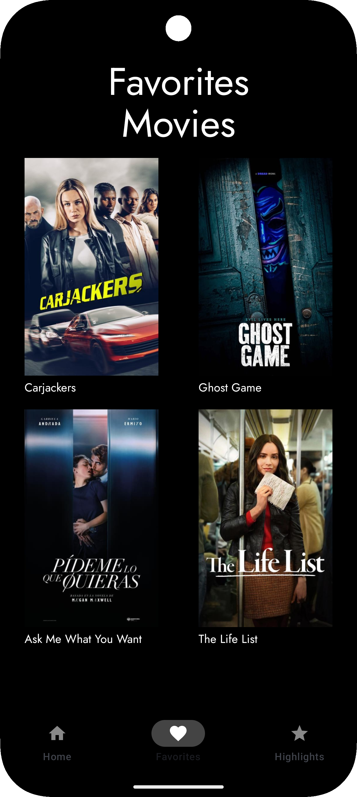
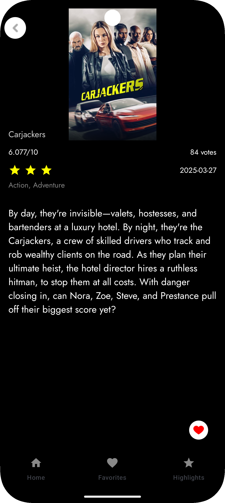

# MovieApp

**MovieApp** is a personal project designed to bring the magic of cinema right to your fingertips. With a sleek, intuitive interface, the app lets you explore a diverse collection of movies across various genres. Whether you’re looking to discover a new blockbuster or revisit an old favorite, MovieApp is crafted to enhance your movie-watching experience.

## Features

- **HomeScreen:**  
  Browse a dynamic selection of films organized by genres such as Romance, Horror, Action, and Suspense. Enjoy a random movie feature that refreshes your experience every time you open the app.

- **DetailScreen:**  
  Dive into detailed information about each movie, including ratings, reviews, release dates, and more. Decide what to watch next with all the details at hand.

- **FavoriteScreen:**  
  Easily mark movies as favorites and keep track of your top picks for quick access.

- **HighlightScreen:**  
  Enjoy a curated showcase of the highest-rated movies, presented in a visually captivating format that celebrates the best in cinema.

## Screenshots

| Home Screen | Favorite Screen | Highlight Screen | Detail Screen |
|-----------|---------------|----------------|-------------|
|  |  |  |  |


## 🛠️ Technologies Used

- **Jetpack Compose:** Used to build a modern, reactive, and declarative UI.
- **MVVM Architecture:** Ensures a clean separation of concerns with scalable and maintainable code.
- **Room Database:** Local persistence for favorite movies, using DAOs and `Flow` for real-time updates.
- **Hilt (Dependency Injection):** Efficient and automated dependency injection for ViewModels, repositories, and the database.
- **Retrofit + Gson:** Communicates with TheMovieDB API and handles JSON parsing automatically.
- **Coil (Image Loading):** Asynchronous image loading with native support for Jetpack Compose.
- **Accompanist Pager:** Carousel with smooth page transitions and indicator support for highlight movies.
- **StateFlow / MutableStateFlow:** Reactive state management to keep UI in sync with data.
- **Custom Animations:** Smooth fade/scale animations on images and interactive components for better UX.


## Getting Started

To run MovieApp locally:

1. **Clone the repository:**

    
```bash
git clone https://github.com/AllanAviana/MovieApp-Android.git
```


2. **Open the project in Android Studio.**

3. **Build and run** on your emulator or physical device.
